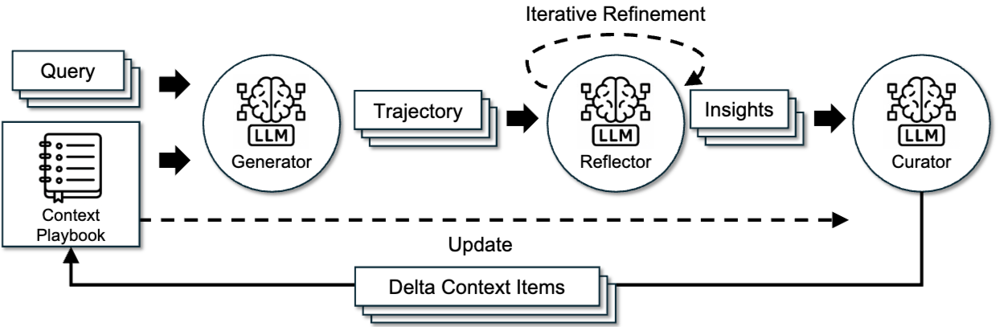
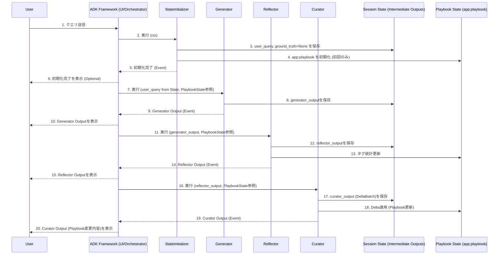

# ACE-ADK (Agentic Context Engineering – Agent Development Kit)



本プロジェクトは、論文の手法を Google ADK を用いて再現したエージェント実装のスターターです。回答生成→内省→知見反映を繰り返す「Agentic Context Engineering」を実装し、初見でも5分でローカル起動し全体像を把握できることを目指します。

## 1. 何ができるか（What & Why）

- 生成（Generator）→ 反省・タグ付け（Reflector）→ プレイブック更新（Curator）を1サイクルで実行
- 学習した知見を `app:playbook` に反映し、次回以降の回答品質を継続改善
- スキーマ厳格・小さなモデル運用（低コスト）で再現性と保守性を重視

## 2. クイックスタート（ローカル最小）

前提: macOS（または同等環境）、Python（`.python-version` 参照）、`uv` が利用可能

```bash
# 依存関係インストール
uv sync

# 起動
uv run main.py
```

期待される結果: ローカルで Web UI / API（またはCLI）が起動し、1サイクル実行の流れを試せます。

## 3. アーキテクチャ概要（要点）

テキスト図（内部詳細はリンク先参照）:

```text
StateInitializer → Generator → Reflector → Curator → (更新された state)
```



- Generator: 回答と軌跡（reasoning, bullet 参照）を生成
- Reflector: 出力を評価し、bullet を helpful/harmful/neutral でタグ付け
- Curator: タグと考察に基づき `app:playbook` を ADD/UPDATE/REMOVE

内部仕様・スキーマの詳細は `agents/ace_agent/README.md` を参照してください（本READMEは入口のみ）。

## 4. プロジェクト構造（抜粋）

- `main.py`: ローカル Web UI/API のエントリ
- `config.py`: 設定
- `pyproject.toml`: 依存とツール設定（`uv` 対応）
- `agents/ace_agent/`: ACE エージェントの実装
  - `agent.py`: 連携と状態初期化、`root_agent` 定義
  - `sub_agents/`: `generator.py` / `reflector.py` / `curator.py`
  - `schemas/`: `playbook.py` / `delta.py`
- `.env.example`: 環境変数の雛形
- `refs/`: 参考リンク

詳細は次を参照: `agents/ace_agent/README.md`

## 5. 設定（`.env`）

- 最初に `cp .env.example .env` を実行し、必要な項目を編集してください。
- 本リポジトリは将来的な GCP/Vertex AI Agent Engine 利用を想定します。未設定の場合は起動に失敗することがあります。
- 最小ローカル体験を目的とする場合でも、`.env` 自体の存在は必須です。

## 6. よくある質問 / トラブルシュート

1) 依存解決に失敗する
   - `uv sync` を再実行し、エラーログに従って解決してください。
2) 起動時に環境変数エラー
   - `.env` を作成したか、キー名の誤字・未設定がないか確認してください。
3) Python バージョン不一致
   - `.python-version` を参照し、環境を一致させた上で `uv sync` をやり直してください。

## 7. 参考資料・関連ドキュメント

- エージェント内部仕様: `agents/ace_agent/README.md`
- Agentic Context Engineering（参考）: `refs/Agentic Context Engineering.url`
