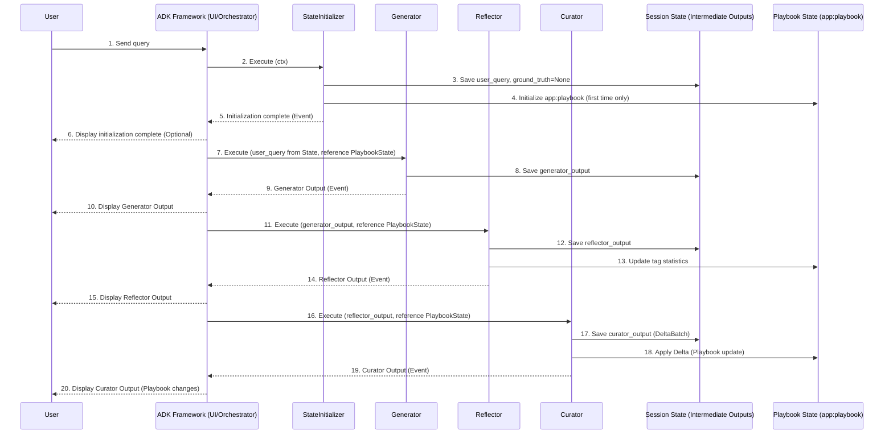

# ACE-ADK (Agentic Context Engineering – Agent Development Kit)

This project is a starter implementation of agents that reproduces research paper methods using Google ADK. It implements "Agentic Context Engineering" that repeats the cycle of answer generation → introspection → knowledge reflection, aiming to enable local startup and understanding of the overall picture in 5 minutes even for first-time users.

## 1. What It Can Do (What & Why)

- Execute one cycle of Generation (Generator) → Reflection & Tagging (Reflector) → Playbook Update (Curator)
- Reflect learned insights into `app:playbook` to continuously improve answer quality for future interactions
- Focus on reproducibility and maintainability with strict schema and small model operations (low cost)

## 2. Quick Start (Local Minimal)

Prerequisites: macOS (or equivalent environment), Python (see `.python-version`), `uv` available

```bash
# Install dependencies
uv sync

# Launch
uv run main.py
```

Expected result: Web UI / API (or CLI) starts locally, allowing you to test the flow of one cycle execution.

## 3. Architecture Overview (Key Points)

Text diagram (see links for internal details):

```text
StateInitializer → Generator → Reflector → Curator → (updated state)
```



- Generator: Generate answers and traces (reasoning, bullet references)
- Reflector: Evaluate output and tag bullets as helpful/harmful/neutral
- Curator: ADD/UPDATE/REMOVE `app:playbook` based on tags and considerations

## 4. Internal Architecture & Specifications

### Agent Components

- **StateInitializer** (`BaseAgent`)
  - Input: `user_content`
  - Output: `state_delta` (`user_query`, `app:playbook` initialization, explicit `ground_truth=None`)
- **Generator** (`Agent`)
  - Model: `Config.generator_model`
  - Output schema: `GeneratorOutput(reasoning: list[str], bullet_ids: list[str], final_answer: str)`
  - State reflection: `session.state['generator_output']`
- **Reflector** (`SequentialAgent` = `reflector_` + `tag_bullet`)
  - Model: `Config.reflector_model`
  - Output schema: `Reflection(...)` and `bullet_tags: list[BulletTag]`
  - `tag_bullet` calls `Playbook.update_bullet_tag` to add tag statistics
  - State reflection: `session.state['reflector_output']`, updated `app:playbook`
- **Curator** (`SequentialAgent` = `curator_` + `playbook_updater`)
  - Model: `Config.curator_model`
  - Output schema: `DeltaBatch(reasoning, operations: DeltaOperation[])`
  - `playbook_updater` applies `Playbook.apply_delta`
  - State reflection: updated `app:playbook`, `session.state['curator_output']`

### Execution Flow
```text
StateInitializer → Generator → Reflector(reflector_→tag_bullet) → Curator(curator_→playbook_updater)
```

### State Keys (session.state)
- `user_query`: Latest user input
- `app:playbook`: Dictionary representation of `Playbook` (includes section/ID management and tag statistics)
- `generator_output`: `GeneratorOutput`
- `reflector_output`: `Reflection` (includes `bullet_tags`)
- `curator_output`: `DeltaBatch`
- `ground_truth` (optional): Expected answer

### Data Models
- **`schemas/playbook.py`**
  - `Bullet(id, section, content, helpful, harmful, neutral, created_at, updated_at)`
  - `Playbook`
    - Main operations: `add_bullet`, `update_bullet`, `remove_bullet`, `update_bullet_tag`, `apply_delta`
    - Serialization: `to_dict`/`from_dict`/`dumps`/`loads`
    - For prompting: `as_prompt()`, `stats()`
- **`schemas/delta.py`**
  - `DeltaOperation(type: "ADD"|"UPDATE"|"REMOVE", section, content?, bullet_id?)`
  - `DeltaBatch(reasoning: str, operations: List[DeltaOperation])`

## 5. Project Structure (Excerpt)

- `main.py`: Entry point for local Web UI/API
- `config.py`: Configuration
- `pyproject.toml`: Dependencies and tool settings (`uv` compatible)
- `agents/ace_agent/`: ACE agent implementation
  - `agent.py`: Coordination and state initialization, `root_agent` definition
  - `sub_agents/`: `generator.py` / `reflector.py` / `curator.py`
  - `schemas/`: `playbook.py` / `delta.py`
- `.env.example`: Environment variable template
- `refs/`: Reference links

## 6. Configuration (`.env`)

- First, run `cp .env.example .env` and edit the necessary items.
- This repository assumes future use of GCP/Vertex AI Agent Engine. If not configured, startup may fail.
- Even for minimal local experience, the existence of `.env` itself is required.

## 7. FAQ / Troubleshooting

1) Dependency resolution fails
   - Re-run `uv sync` and resolve according to error logs.
2) Environment variable error at startup
   - Check if `.env` was created and if there are no typos or unset key names.
3) Python version mismatch
   - Refer to `.python-version`, match the environment, and retry `uv sync`.

## 8. Interaction Examples (Conceptual)

1) When user sends a query, `user_query` is set, and if `app:playbook` is undefined, it's initialized
2) `Generator` generates `GeneratorOutput` (reasoning/bullet_ids/final_answer)
3) `Reflector` generates `Reflection` and adds tags to bullets via `tag_bullet`
4) `Curator` returns `DeltaBatch` and `playbook_updater` applies ADD/UPDATE/REMOVE

## 9. Customization & Extension

### Easy Modifications
- **Model switching**: Change each model name in `config.py`
- **Collection enhancement**: Expandable to design that injects `Playbook.as_prompt()` into prompts
- **Automatic organization**: Addition of maintenance jobs based on `Playbook.stats()` and tag statistics

### Known Constraints
- ADK dependencies and execution environment are prerequisites
- External API authentication is minimal in this repo (expand with `.env`/environment variables as needed)

## 10. Export & Integration

- `agents/ace_agent/__init__.py` exposes `root_agent` (actual entity is `ace_iteration`)
- The system can be integrated into larger applications or used as a standalone service
